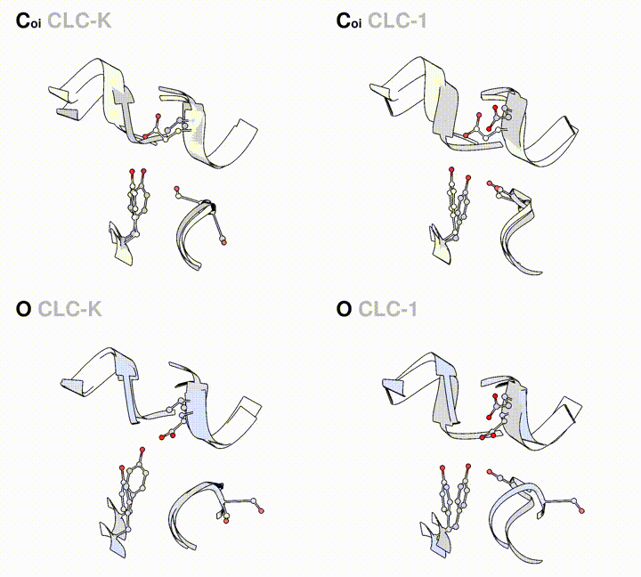

# clc2-dynamical-model

Data accompanying [Dynamical model of the CLC-2 ion channel exhibits a two-step gating mechanism](https://www.biorxiv.org/content/early/2018/03/07/228163).


### simulation data

Full simulation dataset is available online via the Stanford Digital Repository.
```
McKiernan, Keri A. and Koster, Anna K. and Maduke, Merritt and Pande, Vijay S. (2019). 
Molecular dynamics simulations of the CLC-2 ion channel. Stanford Digital Repository. 
Available at: https://purl.stanford.edu/rq847qm8302
```

Note that this data is provided in a compressed format (`xtc`) and will need to be loaded using an uncompressed (`pdb`) topology file. These topology files are provided in `simulation_data/sdr.tar.gz`.

### macrostate conformations

Four distinct protein macrostates were derived by this study. PDB files for each macrostate monomer and selectivity filter are provided here: `pdb/mono_{macrostate label}.pdb` and `pdb/sf_{macrostate_label}.pdb`. The `{macrostate label}` for each state is illustrated below.


### sf rotation movies

Movies showing the overlay of key selectivity conformational states and
reference experimental structures are given in the `sf_rotation_movies`
directory.



### pore radius data

Data used to construct Figure 5 of the manuscript is contained in the
`pore_radii` directory.

### sequence alignment

Alignment of the CLC-2 model with the 3ORG template structure monomer and
selectivity filter are given in the `sequence_alignment` directory.

### citation

If you make use of this data, please cite it.
```
@article{mckiernan2018dynamical,
  title={Dynamical model of the CLC-2 ion channel exhibits a two-step gating mechanism},
  author={McKiernan, Keri A and Koster, Anna K and Maduke, Merritt and Pande, Vijay S},
  journal={bioRxiv},
  pages={228163},
  year={2018},
  publisher={Cold Spring Harbor Laboratory}
}
```
