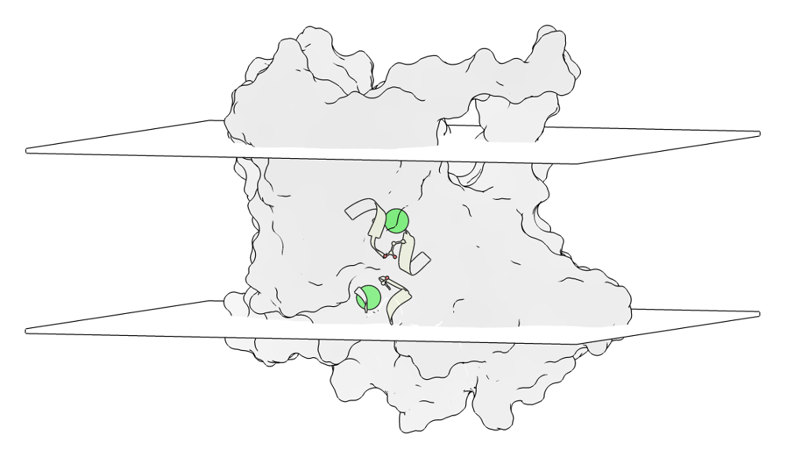
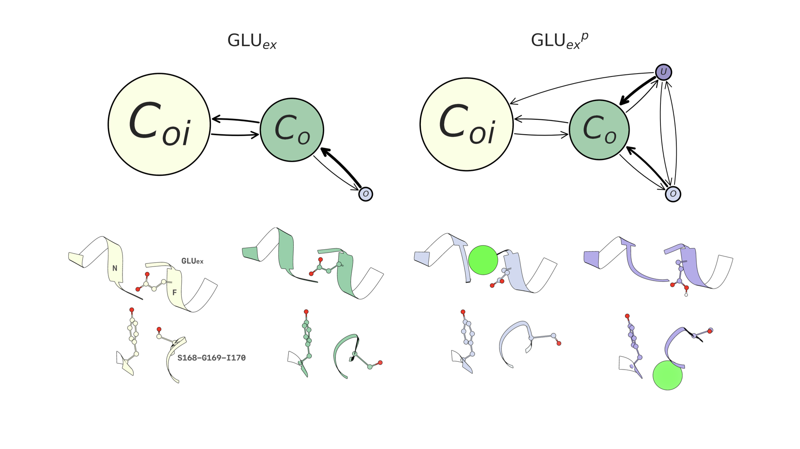

# clc2-dynamical-model

Data accompanying [Dynamical model of the CLC-2 ion channel exhibits a two-step gating mechanism](https://www.biorxiv.org/content/early/2018/03/07/228163).



### macrostate conformations

Four distinct protein macrostates were derived by this study. PDB files for each macrostate monomer and selectivity filter are provided here: `pdb/mono_{macrostate label}.pdb` and `pdb/sf_{macrostate_label}.pdb`. The `{macrostate label}` for each state is illustrated below.



### sequence alignment

Alignment of the CLC-2 model with the 3ORG template structure monomer and
selectivity filter are given in the `sequence_alignment` directory.

### citation

If you make use of this data, please cite it.
```
@article{mckiernan2018dynamical,
  title={Dynamical model of the CLC-2 ion channel exhibits a two-step gating mechanism},
  author={McKiernan, Keri A and Koster, Anna K and Maduke, Merritt and Pande, Vijay S},
  journal={bioRxiv},
  pages={228163},
  year={2018},
  publisher={Cold Spring Harbor Laboratory}
}
```
